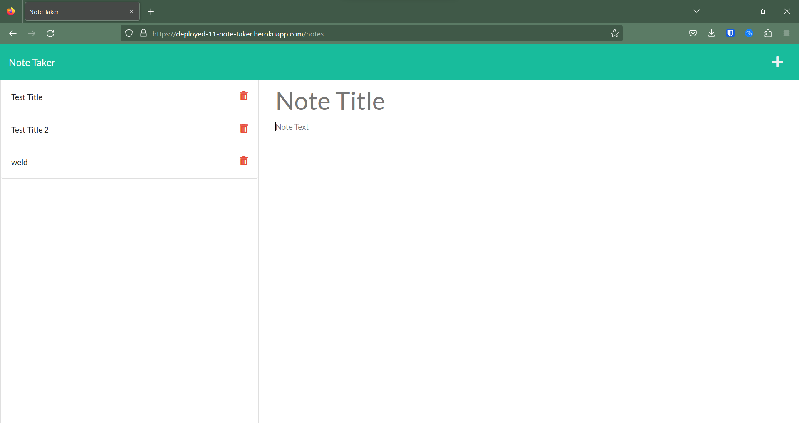

# Live Note Taker

## Badges & License

## Table of Contents

- [Project Description](#project-description)
- [Visuals](#visuals)
- [Installation Instructions](#installation-instructions)
- [Usage Instructions](#usage-instructions)
- [Contribution Guidelines](#contribution-guidelines)
- [Testing Procedure](#testing-procedure)
- [Contact & Questions](#contact--questions)

## Project Description
This app will is live on heroku and allow users to create and save custom notes

## Visuals

## Installation Instructions
go to [Note Taker](https://deployed-11-note-taker.herokuapp.com/notes) to access the application

## Usage Instructions
Open the webpage, click "get started", create a new note, and save it. then the note can be retrieved later

## Contribution Guidelines
n/a
## Testing Procedure
n/a

## Contact & Questions
You can reach us at  or
at our github page https://www.github.com/bikeller104/

